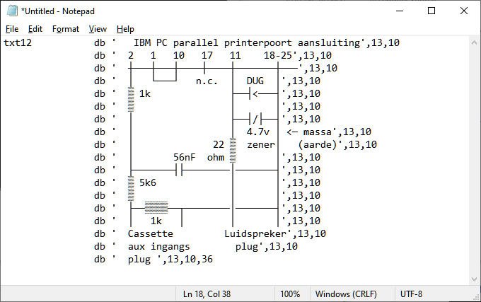

# BASICODE for MS-DOS
By Jac Goudsmit.

This repository contains the source files that I found in my archives that were intended for Basicode 3 support for the IBM PC Compatible computers under MS-DOS.

These were written a long time ago, between 1987 and 1989. The code was never released. Some of this stuff I wrote myself, and some of the code was based on another implementation of BASICODE for the IBM PC by someone named B.S.H. Niewold. It's unclear right now which parts are mine and which parts are not, and I don't remember any official licensing information but I'm going to assume that Niewold's code was public domain. My code is too.

I can't find any source code on Google for Basicode on the IBM PC so I decided to put this on Github, for reference only. I remember recording BASICODE 2 programs from the radio in that time and running them in the IBM PC, but from a quick glance at the code, it looks like Basicode 3 features such as reading and writing data files from/to tape were never finished.

# How It Works

## Brief History of BASICODE  

BASICODE was developed [in the late 1970s and early 1980s](https://www.hobbyscoop.nl/the-history-of-basicode/) in the Netherlands, by the makers of the "Hobbyscoop" show on national radio. They had previously transmitted programs for home computers over the air as part of their show, but they wanted to create a universal format that would be usable on all computers.

The original standard defined how the bits and bytes are encoded, and how the programs were formatted on tape (basically the program was stored in ASCII, and only the BASIC commands and functions that were supported by all computers were allowed).

The BASICODE 2 standard mandated that programs would start at line 1000, and all lines that have lower numbers are used by the computer-specific code that does things that are different on every computer. For example, if a program wanted to clear the screen it would use GOSUB 100, where there might be a PRINT CHR$(147);:RETURN on a Commodore, or a CLS on other machines.

BASICODE 3 had even more features including limited graphics, sound and the ability to read and write data files from and to tapes. However it wasn't widely used.

It wasn't until 1986 or 1987 until there was BASICODE software for the IBM PC (and compatibles). Since only the original 5150 IBM PC had a cassette interface, it was necessary to build your own tape recorder interface, and it was difficult to get the software because you couldn't just order the BASICODE cassette and read it from there: you had to get it on floppy disk.

I don't remember how I did it, but I somehow got my hands on the source code for the BASICODE software for DOS on the IBM PC around 1987. I probably downloaded it from a BBS. There was no BASICODE 3 software for the PC. So I set myself a task: I would make BASICODE 3 software for the PC, based on what I had. I don't know how far I got but I know I eventually lost interest and moved to other projects. 

I don't have the interface (or its schematics) anymore. I kept my source files and the compiled versions that are intended to run under DOS and stored them in this Github repo. I don't know what state the software is in; I know I used my software to successfully load BASICODE programs recorded from the radio but I don't even remember what the steps were to do that. 

## IBM PC (5150) Tape Interface

The original IBM PC (5150) had a cassette port on the motherboard that was connected to the 8255 PPI (Programmable Peripheral Interface) and the 8253 PIT (Programmable Interval Timer) chips.

The output to the tape recorder's recording input was basically generated the same way as the output to the speaker. The input from the cassette's playback output was connected to a pin on the PPI where the PC/XT was connected to the second DIP switch block.

There was a relay on the motherboard to turn the motor of the cassette recorder on and off. The DIN socket to connect a tape recorder had a non-standard layout:

* Pins 1 and 3 were connected to the relay for motor control; when the PC turns the motor relay on, these pins are connected together
* Pin 5 is the output (recording) signal, at microphone level
* Pin 4 is the input (playback) signal, at speaker level
* Pin 2 is ground.

## Printer Port Interface

The IBM PC/XT (5160) didn't have a cassette port, and neither did any other IBM-PC's or compatibles. So to use a cassette recorder for BASICODE, it was necessary to build your own interface.

Someone designed an interface for the parallel port and added the ASCII schematic to the CAS.COM program. If you load the CAS2.ASM source code into Notepad, you'll see it:

You should not use this schematic! See below.

* Pin 2 = D0 out
* Pin 1 = ~STROBE out
* Pin 10 = ACK in
* Pin 11 = ~BUSY in
* Pin 18-25 = GND

I don't like the way that the diode (DUG=Diode Universal Germanium) is connected in parallel with the input pin of the printer port. It clamps the voltage on the input to negative 0.3 V. Better would be to put a diode in series with the 22 Ohm resistor (with the cathode towards the printer port and the anode towards the cassette recorder), so that the input is clamped to a positive voltage. A silicon diode such as the 1N4148 would do fine in series with the 22 Ohm resistor, and the voltage would never go below 0.6V positive. It may be necessary to add a pull-down resistor on the ~BUSY input too; 5K6 from pin 11 to GND should do it but I haven't tested this. 

## Software

The cassette could not be used easily from DOS. PC-DOS had no support for the cassette. Only cassette-BASIC can load and save programs to cassette (cassette BASIC is what gets started if you boot an IBM PC without boot floppy and of course without hard disk -- the 5150 originally didn't have hard disk support).

The original 5150 PC had code in the BIOS to read and write programs to and from the tape recorder. They were accessed via an Int 15h instruction. In the 5160 PC/XT, this code was removed because there was no tape interface anymore; the pins on the PPI that previously were used for the tape recorder interface were repurposed for the second DIP switch block.

My predecessor who wrote the original BASICODE software for DOS made a program called CAS.COM. That program was a Terminate and Stay Resident (TSR) utility that would install itself in memory and redirect any Int 15h requests to either the original PC tape interface or to a parallel port. Besides the functions from the original IBM PC BIOS that can read and write IBM formatted tapes(!), there are also some new functions that can be used to read and write tape in the BASICODE 1200bps format.

I don't have that CAS.COM program anymore but I do have the CAS2 and CAS3 programs which I wrote myself, and are apparently based on a reverse-engineering of the CAS.COM file. 

After you install CAS2 or CAS3, you should be able to use the other software to read and write BASICODE programs from/to tape.

Here's a list of source code files and their purpose, based on a cursory look:

* BAS2BC: Converts an ASCII BASIC program saved on disk with the SAVE "FILENAME",A command in GWBASIC to BASICODE format.
* BC: Libraries for BASICODE programs. Unfinished?
* BC2BAS: Converts BASICODE program on disk to ASCII BASIC format
* BCMSGDF: Messages for what was supposed to be BASICODE 3 Datafile Support. Looks unfinished.
* BCODE3.BAS: file that should be merged with BASICODE 2 or 3 programs to make them work
* BCREAD.ASM: Library to read BASICODE program from disk. Unfinished?
* BCREADDF.ASM: Library to read data files in BASICODE 3 format. Unfinished?
* BCWRITE.ASM: Library to write BASICODE to tape
* CAS2.ASM: Cassette control TSR, reverse-engineered from CAS.COM
* CAS3.ASM: Partially rewritten version of CAS2.ASM
* WRITEBC.ASM: Program to write BASICODE programs to tape.

Some of the programs execute each other; for example WRITEBC.COM starts BAS2BC.COM to convert a program before it actually writes it to tape.

Some programs were written in Microsoft Macro Assembler 1.0, but some were written in MASM 5.1 which I purchased some time in 1988. I recommend using the latter of course.

Hopefully over time, my memory of what I was up to in 1988 will return, and I can update this documentation.